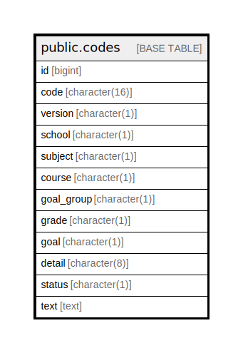

# public.codes

## Description

## Columns

| Name | Type | Default | Nullable | Children | Parents | Comment |
| ---- | ---- | ------- | -------- | -------- | ------- | ------- |
| id | bigint | nextval('codes_id_seq'::regclass) | false |  |  |  |
| code | character(16) |  | false |  |  |  |
| version | character(1) |  | false |  |  |  |
| school | character(1) |  | false |  |  |  |
| subject | character(1) |  | false |  |  |  |
| course | character(1) |  | false |  |  |  |
| goal_group | character(1) |  | false |  |  |  |
| grade | character(1) |  | false |  |  |  |
| goal | character(1) |  | false |  |  |  |
| detail | character(8) |  | false |  |  |  |
| status | character(1) |  | false |  |  |  |
| text | text |  | false |  |  |  |

## Constraints

| Name | Type | Definition |
| ---- | ---- | ---------- |
| codes_pkey | PRIMARY KEY | PRIMARY KEY (id) |

## Indexes

| Name | Definition |
| ---- | ---------- |
| codes_pkey | CREATE UNIQUE INDEX codes_pkey ON public.codes USING btree (id) |

## Relations

---

> Generated by [tbls](https://github.com/k1LoW/tbls)
